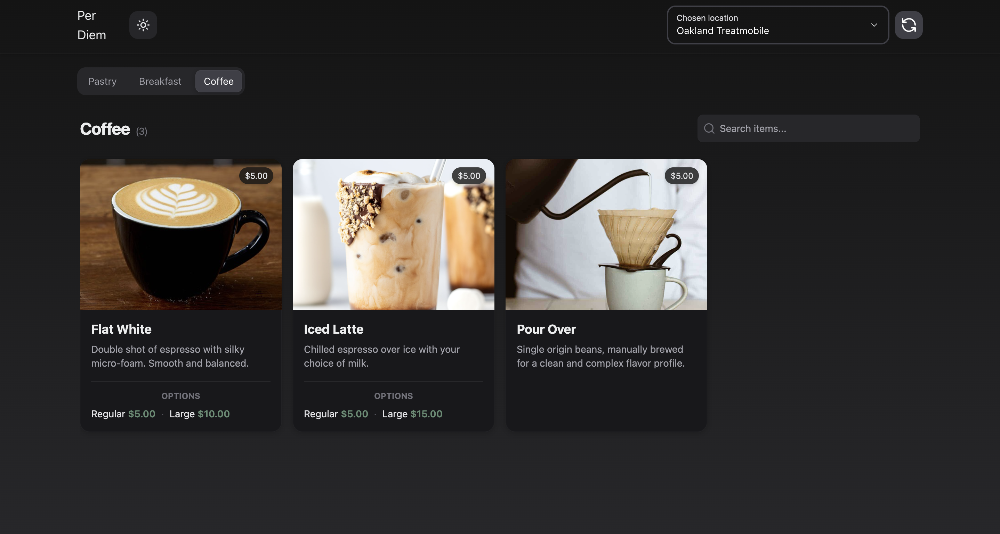
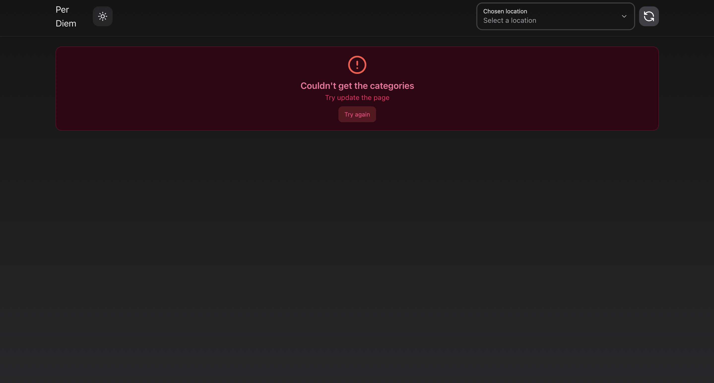
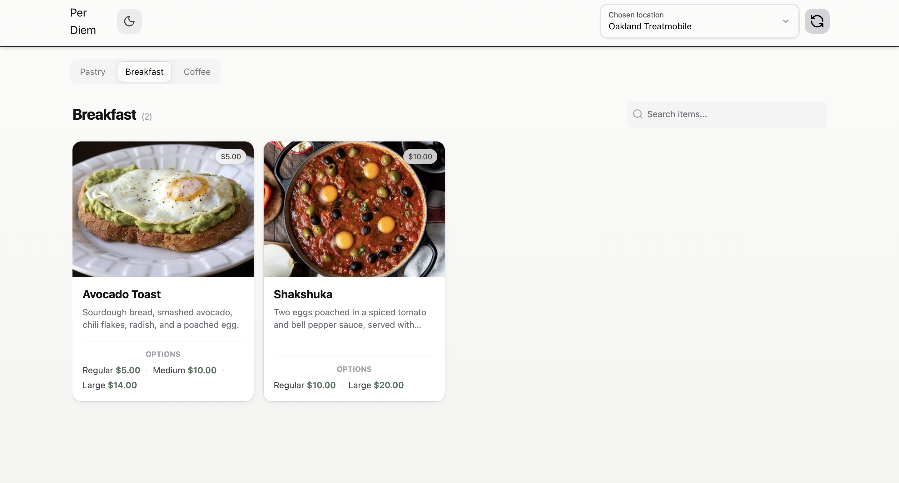
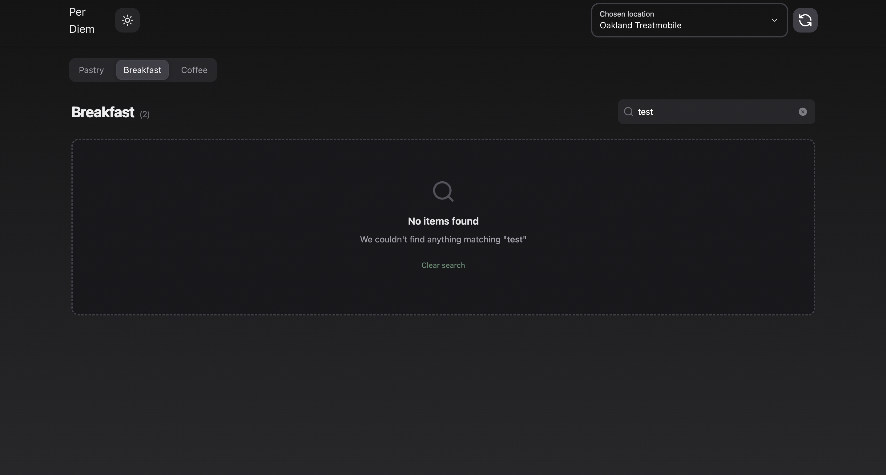
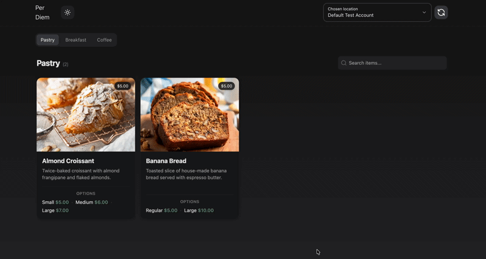
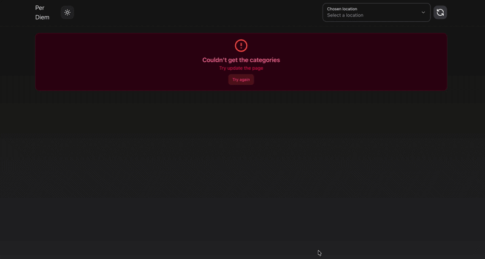

🚀 Per Diem Fullstack Monorepo
A robust fullstack application built with a focus on Clean Architecture, scalability, and developer experience. This project manages locations, categories, and menu items with a seamless UI/UX.

Some video fo working in the app

🛠 Tech Stack
Frontend
Framework: Next.js (App Router)

Styling: TailwindCSS & HeroUI

State Management: Zustand

Data Fetching: TanStack Query & ky

Backend
Framework: Nest.js

Language: TypeScript

Architecture: Clean Architecture

Infrastructure
Package Manager: pnpm (Workspaces)

Containerization: Docker & Docker Compose

Environment: Mac optimized

🏗 Architecture Decisions & Trade-offs
1. Monorepo (pnpm Workspaces)
   Decision: Used a monorepo to keep frontend and backend in a single source of truth.

Trade-off: Slightly more complex initial setup, but much easier to share TypeScript types (DTOs) between the server and the client in the future.

2. Clean Architecture
   Decision: Separated business logic from framework-specific code. Backend follows a modular Nest.js structure; Frontend uses a layered approach (Components -> Hooks -> Services -> API).

Trade-off: More "boilerplate" code initially, but significantly higher maintainability and testability as the project grows.

3. State Management (Zustand)
   Decision: Chose Zustand over Redux/RTK for its simplicity and minimal bundle footprint.

Trade-off: Less "opinionated" than Redux, requiring more discipline in state structure.

4. API Layer (ky + TanStack Query)
   Decision: ky provides a clean, modern fetch wrapper with built-in retry logic and hooks, while TanStack Query handles caching and server-state synchronization perfectly.

⚙️ Setup & Run Instructions
Prerequisites
Node.js (v20+)

pnpm (npm i -g pnpm)

git clone <your-repo-url>

cd per-diem-monorepo

Create .env files in apps/frontend and apps/backend based on the .env.example files provided in each folder.

(Create an account on https://developer.squareup.com/ and take SQUARE_ACCESS_TOKEN from it then change in .env)

pnpm install